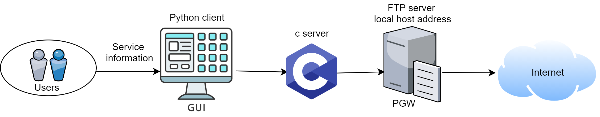

# LTE

The architecture of LTE is composed of the following components:
- E-UTRAN (*Evolved UMTS Terrestrial Radio Access Network*)
- EPC (*The Evolved Packet Core*)


# EPC 

 The EPC represents the Core of an LTE network. It is formed by multiple nodes, the main ones being: 

- MME (*Mobility Management Entity*)
- S-GW (*Serving Gateway*)
- P-GW (*PDN Gateway*)
- HSS (*Home Subscriber Server*)
- PCRF (*Policy and Charging Rules Function*)
	

This nodes offer multiple functionality like mobility management, authentication, 
session management, setting up bearers and application of different Quality of Services.

# PGW 

PGW is the network node that connects the EPC to external IP networks such as Internet. 
What the PGW does is that it routes packets to and from external IP networks. 
Beyond that, it also allocates an IP address to all UEs and
enforces different policies regarding IP user traffic such as packet filtering.
This element is used to configure internet services.

# UNIX SOCKET COMMUNICATION

The application was written using programming languages ​​c and python.
A unix socket was created as a form of communication between python and c, where the python program behaves as a client and the c program as a server.
Data entered by the user using the python GUI client is sent to the server which processes data (makes a series of commands necessary to create services on the PGW platform) and generates the export_service.txt file. After that the FTP protocol is used to import commands to the PGW platform.



# FTP PROTOCOL

Using the FTP protocol export_service.txt is imported to the local host's ftp server.
In this case, the local host's ftp server emulates the FTP server of the PGW element.
The final result of the loaded commands (contained in export_service.txt) is printed on the GUI.

# APPLICATION PARAMETERS

Using a GUI written in Python, the user enters parameters:
- Service name
- Monitoring key - A unique string that identifies service
- Priority of rules - Used in the analysis of packet traffic on PGW, a lower number defines a higher priority
- Rating group - Used by the external system for billing purposes
- Data speed for downlink and uplink
   - Normal speed: Represents the maximum speed defined for data transfer
   - Exhaust speed: It represents data speed after the user has consumed his bytes within the service
- Filtering method - Defines the way in which traffic filtering will be performed. The available filters are:
  - filter all trafic
  - tcp filter
  - udp filter
  - dns filter
  - IP filter
  - domain name filter

- Action performed on service data
  - Registration of the 
   group in the billing record
  - Header enrichment - the process of adding data fields in the HTTP header used by downstream servers (for example MSISDN info)
  - Drop packets


# MAKEFILE

The build management system is **GNU make** and **gcc** is the compiler. The code is dependent on Linux system calls so it isn't buildable in other OSes.

To compile the c binary type:

 **``` make all ```**    

To open the python gui that will pass the configuration to the c server type:

**``` make pythonclient ```**  

To remove the generated binary files type:

**``` make clean ```**

# PURPOSE OF THE APPLICATION

The application was created for the purpose of simplifying the procedure of
creation of internet services on the PGW platform.
The application model is operational only on the newer Huawei versions of the PGW element.
It supports 3G, 4G and 5G networks.
